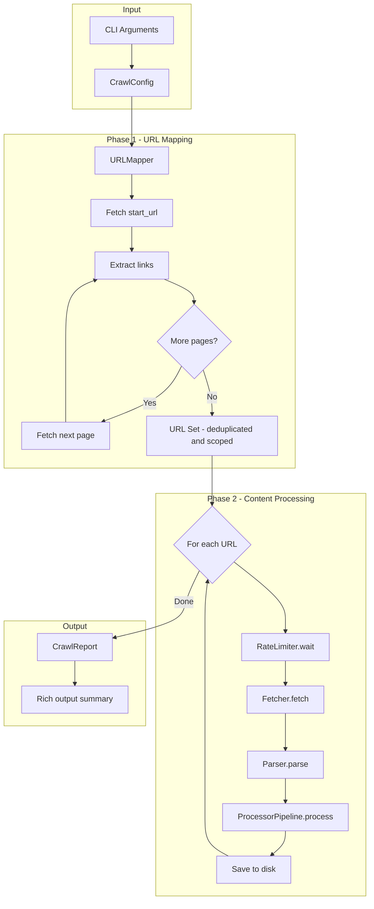
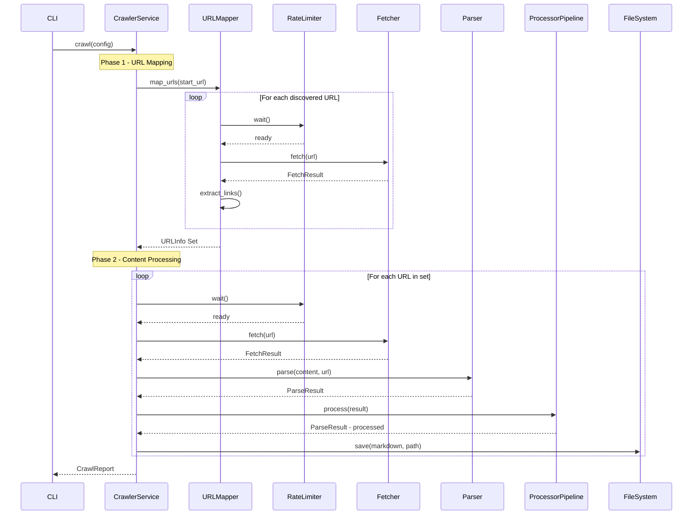
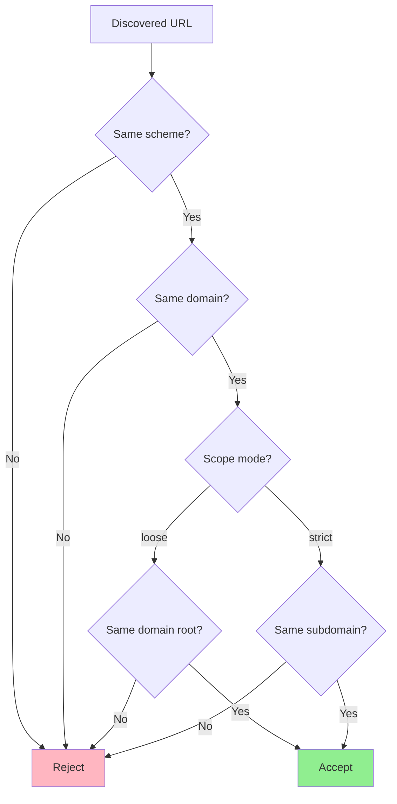

# localexpertcli Architecture Design

A plugin-based CLI tool for crawling documentation websites and converting them to Markdown.

## Table of Contents

1. [Overview](#overview)
2. [Directory Structure](#directory-structure)
3. [Core Components](#core-components)
4. [Class Diagrams](#class-diagrams)
5. [Interface Definitions](#interface-definitions)
6. [Data Flow](#data-flow)
7. [Extension Points](#extension-points)
8. [Configuration](#configuration)

---

## Overview

localexpertcli follows a **plugin-based architecture** with three main extension points:

- **Fetchers**: Retrieve content from various sources (HTTP, browser emulation, local files)
- **Parsers**: Convert raw content to Markdown (HTML, PDF, Word documents)
- **Processors**: Post-process Markdown output through a pipeline (LLM enhancements, noise removal)

The architecture emphasizes:
- **Separation of Concerns**: Each component has a single responsibility
- **Open/Closed Principle**: Easy to extend without modifying core logic
- **Dependency Injection**: Components are injected into the crawler service
- **Strategy Pattern**: Swappable implementations for fetchers and parsers
- **Chain of Responsibility**: Processor pipeline for post-processing

---

## Directory Structure

```
src/localexpertcli/
├── __init__.py                 # Package entry point, version info
├── main.py                     # CLI entry point using typer
│
├── core/
│   ├── __init__.py
│   ├── base_fetcher.py         # Abstract BaseFetcher class
│   ├── base_parser.py          # Abstract BaseParser class
│   ├── base_processor.py       # Abstract BaseProcessor class
│   └── exceptions.py           # Custom exceptions hierarchy
│
├── fetchers/
│   ├── __init__.py
│   ├── http_fetcher.py         # HttpFetcher implementation
│   └── browser_fetcher.py      # Future: Playwright/Selenium fetcher
│
├── parsers/
│   ├── __init__.py
│   ├── html_parser.py          # HtmlToMarkdownParser implementation
│   └── file_parsers/
│       ├── __init__.py
│       ├── pdf_parser.py       # Future: PDF to Markdown
│       └── docx_parser.py      # Future: Word to Markdown
│
├── processors/
│   ├── __init__.py
│   ├── pipeline.py             # ProcessorPipeline implementation
│   ├── identity_processor.py   # Pass-through processor
│   └── llm/
│       ├── __init__.py
│       ├── base_llm.py         # Base LLM processor
│       ├── heading_summary.py  # Future: Add AI summaries to headings
│       └── noise_remover.py    # Future: Remove boilerplate with LLM
│
├── services/
│   ├── __init__.py
│   ├── crawler_service.py      # Main CrawlerService orchestration
│   ├── url_mapper.py           # URL discovery and scope control
│   └── rate_limiter.py         # Politeness and rate limiting
│
├── models/
│   ├── __init__.py
│   ├── crawl_result.py         # CrawlResult dataclass
│   ├── crawl_config.py         # CrawlConfig dataclass
│   └── url_info.py             # URLInfo dataclass for tracking
│
├── utils/
│   ├── __init__.py
│   ├── url_utils.py            # URL manipulation and validation
│   └── file_utils.py           # File I/O utilities
│
└── cli/
    ├── __init__.py
    ├── app.py                  # Typer app definition
    ├── commands.py             # CLI commands
    └── output.py               # Rich output formatting
```

---

## Core Components

### Component Overview Diagram

```
┌─────────────────────────────────────────────────────────────────────┐
│                          CLI Layer                                   │
│  ┌─────────────────────────────────────────────────────────────┐    │
│  │                      typer + rich                            │    │
│  │  Commands: crawl, --url, --output, --max-retries, --dry-run │    │
│  └─────────────────────────────────────────────────────────────┘    │
└──────────────────────────────┬──────────────────────────────────────┘
                               │
                               ▼
┌─────────────────────────────────────────────────────────────────────┐
│                       CrawlerService                                │
│  ┌──────────────┐  ┌──────────────┐  ┌──────────────────────────┐   │
│  │  URLMapper   │  │ RateLimiter  │  │    Orchestration Logic   │   │
│  │              │  │              │  │                          │   │
│  │ - Discover   │  │ - Politeness │  │ 1. Map URLs              │   │
│  │ - Scope      │  │ - Delays     │  │ 2. Fetch Content         │   │
│  │ - Dedupe     │  │              │  │ 3. Parse to Markdown     │   │
│  └──────────────┘  └──────────────┘  │ 4. Process Pipeline      │   │
│                                       │ 5. Save to Disk          │   │
│                                       └──────────────────────────┘   │
└──────────────────────────────┬──────────────────────────────────────┘
                               │
          ┌────────────────────┼────────────────────┐
          │                    │                    │
          ▼                    ▼                    ▼
┌──────────────────┐  ┌──────────────────┐  ┌──────────────────┐
│    Fetchers      │  │     Parsers      │  │   Processors     │
│  ─────────────   │  │  ─────────────   │  │  ─────────────   │
│  BaseFetcher     │  │  BaseParser      │  │  BaseProcessor   │
│      │           │  │      │           │  │      │           │
│  HttpFetcher     │  │  HtmlParser      │  │  Pipeline        │
│  BrowserFetcher  │  │  PdfParser       │  │  LLMProcessor    │
│  (future)        │  │  (future)        │  │  (future)        │
└──────────────────┘  └──────────────────┘  └──────────────────┘
```

---

## Class Diagrams

### Fetcher Hierarchy

```
┌─────────────────────────────────────────┐
│           <<abstract>>                   │
│           BaseFetcher                    │
├─────────────────────────────────────────┤
│ + config: FetcherConfig                  │
├─────────────────────────────────────────┤
│ + fetch(url: str) -> FetchResult        │
│ + is_supported(url: str) -> bool        │
│ # _build_retry_decorator() -> Callable  │
└─────────────────────┬───────────────────┘
                      │
                      │ implements
                      │
        ┌─────────────┴─────────────┐
        │                           │
        ▼                           ▼
┌───────────────────┐    ┌───────────────────┐
│   HttpFetcher     │    │  BrowserFetcher   │
│                   │    │    <<future>>      │
├───────────────────┤    ├───────────────────┤
│ - client: httpx   │    │ - playwright: ... │
│   .Client         │    │ - browser: ...    │
├───────────────────┤    ├───────────────────┤
│ + fetch()         │    │ + fetch()         │
│ + is_supported()  │    │ + is_supported()  │
│ - _execute_req()  │    │ - _render_page()  │
└───────────────────┘    └───────────────────┘

┌─────────────────────────────────────────┐
│           FetcherConfig                  │
├─────────────────────────────────────────┤
│ + max_retries: int = 5                   │
│ + timeout: float = 30.0                  │
│ + user_agent: str                        │
│ + follow_redirects: bool = True          │
└─────────────────────────────────────────┘

┌─────────────────────────────────────────┐
│           FetchResult                    │
├─────────────────────────────────────────┤
│ + url: str                               │
│ + content: bytes                         │
│ + status_code: int                       │
│ + headers: dict                          │
│ + elapsed_time: float                    │
│ + final_url: str  # After redirects     │
└─────────────────────────────────────────┘
```

### Parser Hierarchy

```
┌─────────────────────────────────────────┐
│           <<abstract>>                   │
│           BaseParser                     │
├─────────────────────────────────────────┤
│ + config: ParserConfig                   │
├─────────────────────────────────────────┤
│ + parse(content: bytes, url: str)       │
│       -> ParseResult                     │
│ + can_parse(content_type: str) -> bool  │
└─────────────────────┬───────────────────┘
                      │
                      │ implements
                      │
        ┌─────────────┼─────────────┐
        │             │             │
        ▼             ▼             ▼
┌─────────────┐ ┌─────────────┐ ┌─────────────┐
│HtmlToMark   │ │ PdfParser   │ │ DocxParser  │
│downParser   │ │  <<future>> │ │  <<future>> │
├─────────────┤ ├─────────────┤ ├─────────────┤
│ - markitdown│ │ - pdfplumber│ │ - python-   │
│ - soup: BS4 │ │   or pypdf  │ │   docx      │
├─────────────┤ ├─────────────┤ ├─────────────┤
│ + parse()   │ │ + parse()   │ │ + parse()   │
│+can_parse() │ │+can_parse() │ │+can_parse() │
│-extract_    │ │-extract_    │ │-extract_    │
│ metadata()  │ │ text()      │ │ text()      │
└─────────────┘ └─────────────┘ └─────────────┘

┌─────────────────────────────────────────┐
│           ParseResult                    │
├─────────────────────────────────────────┤
│ + markdown: str                          │
│ + title: str | None                      │
│ + metadata: dict                         │
│ + links: list[str]  # Extracted links    │
│ + source_url: str                        │
└─────────────────────────────────────────┘
```

### Processor Pipeline (Chain of Responsibility)

```
┌─────────────────────────────────────────┐
│           <<abstract>>                   │
│           BaseProcessor                  │
├─────────────────────────────────────────┤
│ + name: str                              │
│ + priority: int  # Lower = runs first   │
├─────────────────────────────────────────┤
│ + process(result: ParseResult)          │
│       -> ParseResult                     │
│ + should_process(result: ParseResult)   │
│       -> bool                            │
└─────────────────────┬───────────────────┘
                      │
                      │ implements
                      │
        ┌─────────────┼─────────────┐
        │             │             │
        ▼             ▼             ▼
┌─────────────┐ ┌─────────────┐ ┌─────────────┐
│ Identity    │ │ HeadingSum  │ │ NoiseRem    │
│ Processor   │ │ maryProcessor│ │ overProcessor│
│             │ │  <<future>> │ │  <<future>> │
├─────────────┤ ├─────────────┤ ├─────────────┤
│ + process() │ │ - llm: ...  │ │ - llm: ...  │
│             │ │ + process() │ │ + process() │
└─────────────┘ └─────────────┘ └─────────────┘

┌─────────────────────────────────────────┐
│       ProcessorPipeline                 │
├─────────────────────────────────────────┤
│ - processors: list[BaseProcessor]       │
│ - sorted: bool                          │
├─────────────────────────────────────────┤
│ + add(processor: BaseProcessor)         │
│ + remove(name: str)                     │
│ + process(result: ParseResult)          │
│       -> ParseResult                     │
│ - _sort_by_priority()                   │
└─────────────────────────────────────────┘
```

### Crawler Service

```
┌─────────────────────────────────────────────────────┐
│                  CrawlerService                      │
├─────────────────────────────────────────────────────┤
│ - fetcher: BaseFetcher                               │
│ - parser: BaseParser                                 │
│ - pipeline: ProcessorPipeline                        │
│ - url_mapper: URLMapper                              │
│ - rate_limiter: RateLimiter                          │
│ - config: CrawlConfig                                │
├─────────────────────────────────────────────────────┤
│ + crawl() -> CrawlReport                             │
│ + dry_run() -> URLMappingReport                      │
│ - _map_urls(start_url: str) -> set[URLInfo]         │
│ - _fetch_and_parse(url: URLInfo) -> CrawlResult     │
│ - _save_result(result: CrawlResult) -> Path         │
│ - _is_in_scope(url: str, base_domain: str) -> bool  │
└─────────────────────────────────────────────────────┘

┌─────────────────────────────────────────┐
│              URLMapper                   │
├─────────────────────────────────────────┤
│ - fetcher: BaseFetcher                   │
│ - scope_domain: str | None               │
├─────────────────────────────────────────┤
│ + map_urls(start_url: str)              │
│       -> set[URLInfo]                    │
│ + is_in_scope(url: str) -> bool         │
│ - _extract_links(html: str) -> set[str] │
│ - _normalize_url(url: str) -> str       │
└─────────────────────────────────────────┘

┌─────────────────────────────────────────┐
│             RateLimiter                  │
├─────────────────────────────────────────┤
│ - min_delay: float                       │
│ - max_delay: float                       │
│ - last_request: float                    │
├─────────────────────────────────────────┤
│ + wait()  # Random delay between reqs   │
│ + set_domain_delay(domain: str,         │
│       delay: float)                      │
└─────────────────────────────────────────┘

┌─────────────────────────────────────────┐
│             CrawlConfig                  │
├─────────────────────────────────────────┤
│ + start_url: str                         │
│ + output_dir: Path                       │
│ + max_retries: int = 5                   │
│ + dry_run: bool = False                  │
│ + max_depth: int | None                  │
│ + min_delay: float = 1.0                 │
│ + max_delay: float = 3.0                 │
│ + scope: Literal[strict, loose]          │
│ + concurrency: int = 1  # Future: async │
└─────────────────────────────────────────┘
```

---

## Interface Definitions

### BaseFetcher

```python
from abc import ABC, abstractmethod
from dataclasses import dataclass
from typing import Callable
from tenacity import retry, stop_after_attempt, wait_random_exponential


@dataclass
class FetcherConfig:
    """Configuration for fetcher behavior."""
    max_retries: int = 5
    timeout: float = 30.0
    user_agent: str = "localexpertcli/0.1.0"
    follow_redirects: bool = True


@dataclass
class FetchResult:
    """Result of a fetch operation."""
    url: str
    content: bytes
    status_code: int
    headers: dict[str, str]
    elapsed_time: float
    final_url: str  # URL after any redirects


class BaseFetcher(ABC):
    """Abstract base class for content fetchers.
    
    Fetchers are responsible for retrieving raw content from various
    sources (HTTP, browser emulation, local files).
    
    Extension Point: Implement this class to add new fetch strategies
    (e.g., Playwright for JS-heavy sites, Selenium for complex interactions).
    """
    
    def __init__(self, config: FetcherConfig | None = None):
        self.config = config or FetcherConfig()
    
    @abstractmethod
    def fetch(self, url: str) -> FetchResult:
        """Fetch content from the given URL.
        
        Args:
            url: The URL to fetch from.
            
        Returns:
            FetchResult containing the raw content and metadata.
            
        Raises:
            FetchError: If the fetch fails after all retries.
        """
        pass
    
    @abstractmethod
    def is_supported(self, url: str) -> bool:
        """Check if this fetcher supports the given URL scheme.
        
        Args:
            url: The URL to check.
            
        Returns:
            True if this fetcher can handle the URL.
        """
        pass
    
    def _build_retry_decorator(self) -> Callable:
        """Build tenacity retry decorator with random exponential backoff.
        
        Uses tenacity's wait_random_exponential for jittered backoff
        to avoid thundering herd problems.
        """
        return retry(
            stop=stop_after_attempt(self.config.max_retries),
            wait=wait_random_exponential(
                multiplier=1.0,
                min=1.0,
                max=60.0
            ),
            reraise=True
        )
```

### BaseParser

```python
from abc import ABC, abstractmethod
from dataclasses import dataclass


@dataclass
class ParserConfig:
    """Configuration for parser behavior."""
    extract_links: bool = True
    extract_metadata: bool = True
    preserve_images: bool = True
    code_block_style: str = "fenced"  # fenced or indented


@dataclass
class ParseResult:
    """Result of a parse operation."""
    markdown: str
    title: str | None
    metadata: dict[str, str]
    links: list[str]  # All extracted links for crawling
    source_url: str


class BaseParser(ABC):
    """Abstract base class for content parsers.
    
    Parsers convert raw content (HTML, PDF, Word docs) to Markdown.
    
    Extension Point: Implement this class to add support for new
    content types (PDF, DOCX, RTF, etc.).
    """
    
    def __init__(self, config: ParserConfig | None = None):
        self.config = config or ParserConfig()
    
    @abstractmethod
    def parse(self, content: bytes, url: str) -> ParseResult:
        """Parse raw content into Markdown.
        
        Args:
            content: Raw bytes of the content.
            url: Source URL (used for resolving relative links).
            
        Returns:
            ParseResult with markdown and extracted metadata.
            
        Raises:
            ParseError: If parsing fails.
        """
        pass
    
    @abstractmethod
    def can_parse(self, content_type: str) -> bool:
        """Check if this parser can handle the given content type.
        
        Args:
            content_type: MIME type of the content.
            
        Returns:
            True if this parser can handle the content type.
        """
        pass
```

### BaseProcessor

```python
from abc import ABC, abstractmethod
from dataclasses import dataclass


@dataclass
class ProcessorConfig:
    """Configuration for processor behavior."""
    enabled: bool = True


class BaseProcessor(ABC):
    """Abstract base class for post-processing pipeline.
    
    Processors form a chain-of-responsibility pattern where each
    processor can modify the ParseResult before it's saved.
    
    Extension Point: Implement this class to add post-processing
    steps (LLM enhancements, noise removal, formatting, etc.).
    """
    
    def __init__(self, config: ProcessorConfig | None = None):
        self.config = config or ProcessorConfig()
    
    @property
    @abstractmethod
    def name(self) -> str:
        """Unique name for this processor."""
        pass
    
    @property
    def priority(self) -> int:
        """Priority for ordering (lower = runs first). Default: 100."""
        return 100
    
    @abstractmethod
    def process(self, result: ParseResult) -> ParseResult:
        """Process the parse result.
        
        Args:
            result: The parse result to process.
            
        Returns:
            Modified (or unchanged) parse result.
        """
        pass
    
    def should_process(self, result: ParseResult) -> bool:
        """Determine if this processor should run.
        
        Override to add conditional processing logic.
        
        Args:
            result: The parse result to check.
            
        Returns:
            True if this processor should run.
        """
        return self.config.enabled


class ProcessorPipeline:
    """Manages a chain of processors executed in priority order.
    
    Uses the Chain of Responsibility pattern where each processor
    can modify the result before passing to the next.
    """
    
    def __init__(self):
        self._processors: list[BaseProcessor] = []
        self._sorted: bool = True
    
    def add(self, processor: BaseProcessor) -> "ProcessorPipeline":
        """Add a processor to the pipeline. Returns self for chaining."""
        self._processors.append(processor)
        self._sorted = False
        return self
    
    def remove(self, name: str) -> bool:
        """Remove a processor by name. Returns True if found."""
        for i, p in enumerate(self._processors):
            if p.name == name:
                del self._processors[i]
                return True
        return False
    
    def process(self, result: ParseResult) -> ParseResult:
        """Run all processors in priority order."""
        if not self._sorted:
            self._processors.sort(key=lambda p: p.priority)
            self._sorted = True
        
        current = result
        for processor in self._processors:
            if processor.should_process(current):
                current = processor.process(current)
        
        return current
```

### CrawlerService Interface

```python
from dataclasses import dataclass
from pathlib import Path


@dataclass
class CrawlConfig:
    """Configuration for the crawler service."""
    start_url: str
    output_dir: Path
    max_retries: int = 5
    dry_run: bool = False
    max_depth: int | None = None
    min_delay: float = 1.0
    max_delay: float = 3.0
    scope: str = "strict"  # "strict" = same subdomain only


@dataclass
class CrawlResult:
    """Result of crawling a single URL."""
    url: str
    markdown: str | None
    title: str | None
    status: str  # "success", "failed", "skipped"
    error: str | None = None
    output_path: Path | None = None


@dataclass
class CrawlReport:
    """Final report after crawling completes."""
    total_urls: int
    successful: int
    failed: int
    skipped: int
    results: list[CrawlResult]
    duration_seconds: float


class CrawlerService:
    """Main orchestration service for crawling.
    
    Coordinates the fetch -> parse -> process -> save pipeline.
    """
    
    def __init__(
        self,
        fetcher: BaseFetcher,
        parser: BaseParser,
        pipeline: ProcessorPipeline,
        config: CrawlConfig
    ):
        self._fetcher = fetcher
        self._parser = parser
        self._pipeline = pipeline
        self._config = config
        self._url_mapper = URLMapper(fetcher, config.scope)
        self._rate_limiter = RateLimiter(
            min_delay=config.min_delay,
            max_delay=config.max_delay
        )
    
    def crawl(self) -> CrawlReport:
        """Execute the full crawl process.
        
        1. Map all URLs within scope
        2. For each URL: fetch -> parse -> process -> save
        3. Return final report
        """
        pass
    
    def dry_run(self) -> "URLMappingReport":
        """Map URLs without downloading content.
        
        Useful for previewing what will be crawled.
        """
        pass
```

---

## Data Flow

### Crawl Pipeline Data Flow



### Detailed Processing Flow



### URL Scoping Logic



---

## Extension Points

### 1. Adding a New Fetcher

To add browser emulation support (Playwright):

```python
# src/localexpertcli/fetchers/browser_fetcher.py

from localexpertcli.core.base_fetcher import BaseFetcher, FetchResult, FetcherConfig
from playwright.sync_api import sync_playwright

class BrowserFetcher(BaseFetcher):
    """Fetcher using Playwright for JavaScript-heavy sites."""
    
    def __init__(self, config: FetcherConfig | None = None):
        super().__init__(config)
        self._playwright = sync_playwright().start()
        self._browser = self._playwright.chromium.launch()
    
    @property
    def name(self) -> str:
        return "browser"
    
    def is_supported(self, url: str) -> bool:
        return url.startswith(("http://", "https://"))
    
    def fetch(self, url: str) -> FetchResult:
        @self._build_retry_decorator()
        def _fetch_with_retry():
            page = self._browser.new_page()
            response = page.goto(url, wait_until="networkidle")
            content = page.content()
            return FetchResult(
                url=url,
                content=content.encode(),
                status_code=response.status,
                headers=response.headers,
                elapsed_time=0,
                final_url=page.url
            )
        return _fetch_with_retry()
```

### 2. Adding a New Parser

To add PDF support:

```python
# src/localexpertcli/parsers/file_parsers/pdf_parser.py

from localexpertcli.core.base_parser import BaseParser, ParseResult, ParserConfig
import pdfplumber

class PdfParser(BaseParser):
    """Parser for PDF documents."""
    
    @property
    def name(self) -> str:
        return "pdf"
    
    def can_parse(self, content_type: str) -> bool:
        return content_type == "application/pdf"
    
    def parse(self, content: bytes, url: str) -> ParseResult:
        with pdfplumber.open(io.BytesIO(content)) as pdf:
            markdown_parts = []
            for page in pdf.pages:
                text = page.extract_text()
                markdown_parts.append(text)
            
            return ParseResult(
                markdown="\n\n".join(markdown_parts),
                title=None,
                metadata={"pages": str(len(pdf.pages))},
                links=[],
                source_url=url
            )
```

### 3. Adding a New Processor

To add LLM-based heading summaries:

```python
# src/localexpertcli/processors/llm/heading_summary.py

from localexpertcli.core.base_processor import BaseProcessor, ProcessorConfig
from localexpertcli.models.parse_result import ParseResult

class HeadingSummaryProcessor(BaseProcessor):
    """Adds AI-generated summaries to markdown headings."""
    
    def __init__(self, config: ProcessorConfig, llm_client):
        super().__init__(config)
        self._llm = llm_client
    
    @property
    def name(self) -> str:
        return "heading_summary"
    
    @property
    def priority(self) -> int:
        return 50  # Run early
    
    def process(self, result: ParseResult) -> ParseResult:
        # Find headings and add summaries
        enhanced = self._add_summaries(result.markdown)
        return ParseResult(
            markdown=enhanced,
            title=result.title,
            metadata=result.metadata,
            links=result.links,
            source_url=result.source_url
        )
```

### 4. Plugin Registration Point

Future: Add plugin discovery via entry points:

```python
# In pyproject.toml for a plugin package:
[project.entry-points."localexpertcli.fetchers"]
playwright = "my_plugin.fetchers:PlaywrightFetcher"

[project.entry-points."localexpertcli.parsers"]
pdf = "my_plugin.parsers:PdfParser"

[project.entry-points."localexpertcli.processors"]
summarize = "my_plugin.processors:SummarizeProcessor"
```

---

## Configuration

### CLI Interface Design

```python
# src/localexpertcli/cli/app.py

import typer
from pathlib import Path
from rich.console import Console

app = typer.Typer(
    name="localexpertcli",
    help="Crawl documentation websites and convert to Markdown"
)
console = Console()


@app.command()
def crawl(
    url: str = typer.Argument(
        ...,
        help="Starting URL to crawl"
    ),
    output: Path = typer.Argument(
        ...,
        help="Output directory for markdown files",
        exists=False
    ),
    max_retries: int = typer.Option(
        5,
        "--max-retries", "-r",
        help="Maximum retry attempts for failed requests"
    ),
    dry_run: bool = typer.Option(
        False,
        "--dry-run", "-n",
        help="Map URLs without downloading content"
    ),
    min_delay: float = typer.Option(
        1.0,
        "--min-delay",
        help="Minimum delay between requests (seconds)"
    ),
    max_delay: float = typer.Option(
        3.0,
        "--max-delay",
        help="Maximum delay between requests (seconds)"
    ),
    scope: str = typer.Option(
        "strict",
        "--scope",
        help="Crawling scope: strict (same subdomain) or loose (same domain)"
    ),
):
    """Crawl a documentation website and save as Markdown."""
    from localexpertcli.services.crawler_service import CrawlerService
    from localexpertcli.models.crawl_config import CrawlConfig
    
    config = CrawlConfig(
        start_url=url,
        output_dir=output,
        max_retries=max_retries,
        dry_run=dry_run,
        min_delay=min_delay,
        max_delay=max_delay,
        scope=scope
    )
    
    console.print(f"[bold blue]Starting crawl of:[/] {url}")
    console.print(f"[bold blue]Output directory:[/] {output}")
    
    if dry_run:
        console.print("[yellow]DRY RUN - No files will be downloaded[/]")
    
    # ... crawler initialization and execution


if __name__ == "__main__":
    app()
```

### Example Usage

```bash
# Basic crawl
localexpertcli crawl https://docs.python.org/3/ ./output/

# Dry run to preview URLs
localexpertcli crawl https://docs.python.org/3/ ./output/ --dry-run

# With custom retry and delay settings
localexpertcli crawl https://docs.example.com/ ./output/ \
    --max-retries 10 \
    --min-delay 2.0 \
    --max-delay 5.0 \
    --scope strict
```

---

## Summary

This architecture provides:

| Aspect | Solution |
|--------|----------|
| **Extensibility** | Plugin-based fetchers, parsers, and processors |
| **Testability** | Dependency injection and abstract interfaces |
| **Reliability** | Tenacity retry with random exponential backoff |
| **Politeness** | Configurable random delays between requests |
| **Scope Control** | Strict subdomain limiting by default |
| **Observability** | Rich CLI output with progress reporting |
| **Future-proof** | Entry points for external plugins |

The design follows SOLID principles and enables easy extension without modifying core logic.
